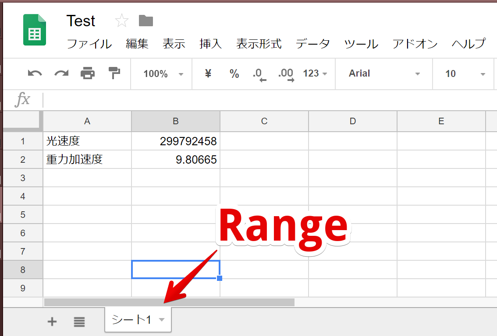

# SpradSheet Load Attribute

# About
Googleスプレッドシートの値を取得、コンポーネントのメンバーへと反映させるCustomAttributeです。<br>
<br>
シーンに最初から配置されているオブジェクトのコンポーネントのメンバ変数の値をGoogleスプレッドシートで上書きします(シーン開始時)<br>

# 使い方 How to use

## セットアップ: Settings.csを編集
Settings.csから以下の３つを設定します<br>
・API KEY<br>
・sheetId<br>
・Range<br>

---

### API Key
Google Console APIで作成したAPI KEYを設定します<br>
https://developers.google.com/sheets/api/guides/authorizing?hl=ja


<br>

### sheetId
GoogleスプレッドシートのsheetIdを設定します。<br>
https://developers.google.com/sheets/guides/concepts?hl=ja

例えば、GoogleスプレッドシートのURLが以下のようになっていた場合は<br>
https://docs.google.com/spreadsheets/d/1qpyC0XzvTcKT6EISywvqESX3A0MwQoFDE8p-Bll4hps/edit#gid=0

Settings.csを以下のように設定します<br>

```
SheetId = "1qpyC0XzvTcKT6EISywvqESX3A0MwQoFDE8p-Bll4hps2";
```
<br>

### Range
Googleスプレッドシートで取得したい範囲を設定します。

Googleスプレッドシートの シート1の値を取得したい場合はSettings.csを以下のように設定します<br>

```
Range = "シート1";
```

<br>

## 2. Write GetField
以下のように記述することで、Googleスプレッドシートの値を反映させることができます。

```csharp
[GetSheet]
public class TestBehaviour : MonoBehaviour
{
    [GetSheet("光速度")] private int _lightSpeed;
```

<br>
Googleスプレッドシートの取得したい値の第１カラムをGetFieldの中で指定します。
